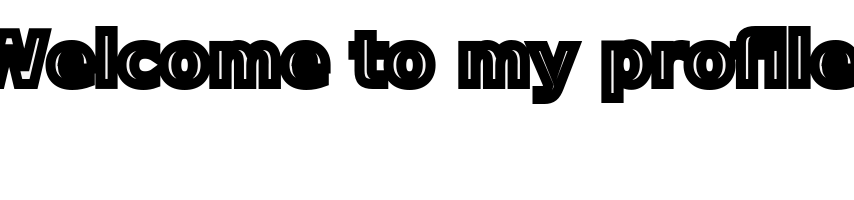
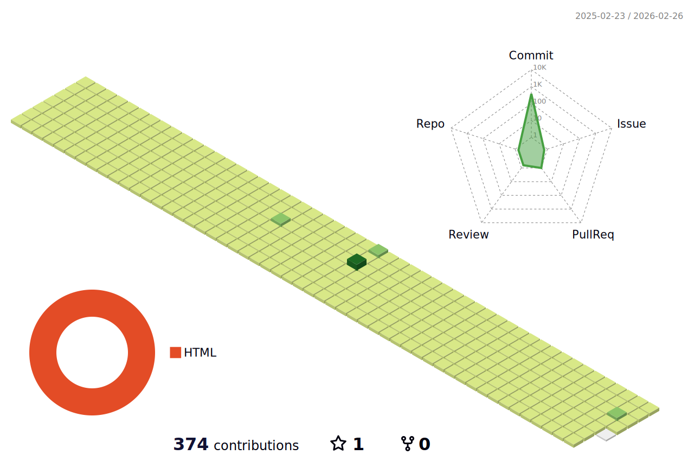
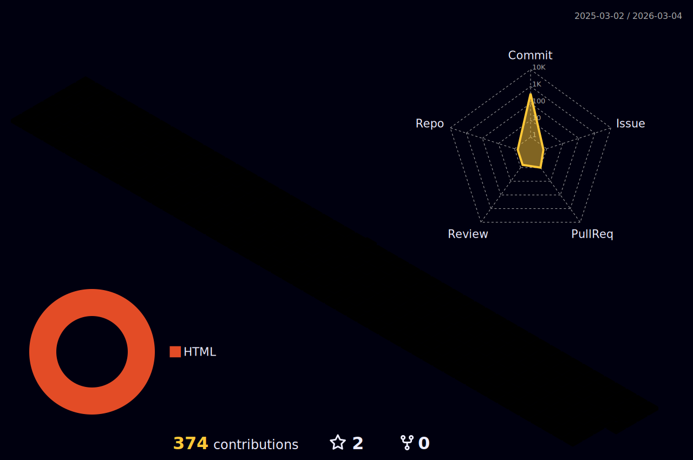

<a href="https://app.daily.dev/vaishnavjois"></a>

[](https://visitcount.itsvg.in)

- 👋 Hi, I’m @VaishnavJois
- 👀 I’m now interested in Exploring Open-Source and its potential.
- 🌱 I’m currently learning Terraform, Git, GitHub an GitLab...
- 💞️ I’m looking to collaborate on privacy focussed open-source projects.
- 📫 How to reach me : [github@jois.slmail.me](mailto:github@jois.slmail.me)
- 🕸️ Checkout my website hosted on GitHub: [vaishnavjois.github.io](https://vaishnavjois.github.io)
- 🕸️ Checkout my BioDrop profile: [VaishnavJois](https://www.biodrop.io/VaishnavJois)
- 💬 Observed something impressive in my GitHub profile or repo : I'll be more than glad if you drop a [testimonial on BioDrop](https://github.com/EddieHubCommunity/BioDrop/issues/new?labels=testimonial&template=testimonial.yml&title=New+Testimonial+for+Vaishnav%20Jois&name=VaishnavJois)
- To check how I showcase #DevCard from [daily.dev](https://app.daily.dev/): [👉Follow the guide👈](https://daily.dev/blog/adding-the-daily-devcard-to-your-github-profile)

---
 
 <!-- dev card status badge -->
 [](https://github.com/VaishnavJois/VaishnavJois/actions/workflows/DevCard.yml)
 
 <!-- generate animation status badge -->
 [](https://github.com/VaishnavJois/VaishnavJois/actions/workflows/grid-snake.yml)

 <!-- GitHub-Profile-Readme-Generator status badge -->
 [](https://github.com/VaishnavJois/VaishnavJois/actions/workflows/profile-3d.yml)


 

<!--
  --->
 
<!--
 --->

<!---[](https://git.io/streak-stats)
--->
<!---[](https://git.io/streak-stats)--->

[](https://git.io/streak-stats)
 
Certifications:

 [](https://www.credly.com/badges/ec9f055e-1f32-4d41-8c03-eb3885924632/public_url)
[](https://www.credly.com/badges/43c62cf9-51fd-4703-ba17-80574538e097/public_url)
[](https://www.credly.com/badges/d07bba10-b20e-4a35-961d-3f94bb841a42/public_url)
[](https://partner.cloudskillsboost.google/public_profiles/2f676384-2141-4b86-8508-dbe1e35cf04a/badges/2708126)

<!---
 ```geojson
{
 "type": "FeatureCollection",
 "features": [
   {
     "type": "Feature",
     "id": 1,
     "properties": {
       "ID": 0
     },
     "geometry": {
       "type": "Polygon",
       "coordinates": [
         [
             [13.340881,74.742142]
         ]
       ]
     }
   }
 ]
}

```
--->


<!---
VaishnavJois/VaishnavJois is a ✨ special ✨ repository because its `README.md` (this file) appears on your GitHub profile.
You can click the Preview link to take a look at your changes.
--->
